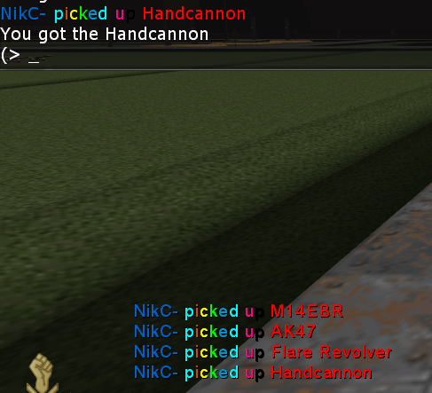

# Weapon Pickup Messages

[](https://github.com/InsultingPros/KFARGBuchonOPQ/releases)

This is a direct upgrade over [original](https://forums.tripwireinteractive.com/index.php?threads/mutator-weapon-pickup-message.51935/) and [dazuz](https://steamcommunity.com/sharedfiles/filedetails/?id=1805798710)'s versions:

- Set any color-tag pairs in [config file](Configs/KFARGBuchonOPQ.ini 'main config') with more flexibility.
- Switch logging into server log.
- Messages look clean in web admin, without unreadable characters.
- Properly processes single pistol pickups.
- Doesn't spam in chat when you try to pickup single pistol while having dualies.



## Installation

```ini
KFARGBuchonOPQ.KFARGBuchonOPQ
```

## Building and Dependencies

Use [KF Compile Tool](https://github.com/InsultingPros/KFCompileTool) for easy compilation.

**EditPackages**

```ini
EditPackages=KFARGBuchonOPQ
```
